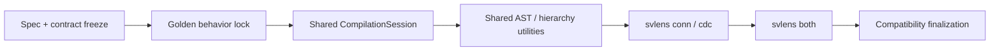

# svlens Unification Spec

Status: Draft  
Owner: sv-conncheck / sv-cdccheck integration effort  
Scope: unify the entrypoint and shared frontend for connectivity + CDC analysis

> Note:
> This document records the original unification design space.
> The current implemented repository state has since converged on a single
> shipped user-facing binary, `svlens`, instead of keeping compatibility
> binaries as public install targets.

---

## 1. Objective

`svlens` is the planned unified executable that consolidates:

- `sv-conncheck`: structural interconnect / port connectivity analysis
- `sv-cdccheck`: structural CDC (Clock Domain Crossing) analysis

The goal is **not** to immediately merge both analysis engines into one data model.
The goal is to:

1. provide a single user-facing binary and execution contract,
2. share elaboration / frontend / common AST utilities,
3. reduce duplicated maintenance,
4. preserve current tool behavior while enabling future deeper convergence.

This spec assumes:

- one common compilation/elaboration path,
- mode-separated execution,
- compatibility wrappers for existing binaries,
- strict TDD for each migration phase.

---

## 2. Problem Statement

Today, `sv-conncheck` and `sv-cdccheck` each:

- parse overlapping CLI/common arguments,
- build a `slang::driver::Driver`,
- elaborate the same SystemVerilog design,
- walk similar hierarchy / AST structures,
- maintain partially overlapping expression-resolution logic,
- output separate reports with separate wrapper flows.

This causes:

- duplicated frontend maintenance,
- drift in source / filelist / top-module handling,
- inconsistent support for expression patterns,
- more regression risk when changing common compilation behavior.

At the same time, the internal analysis goals are still different:

- connectivity analysis is primarily **port / instance interconnect** oriented,
- CDC analysis is primarily **FF / domain / synchronizer** oriented.

Therefore, the integration must preserve separate runners while consolidating the shared substrate first.

---

## 3. High-Level Product Decision

### Decision

Adopt a single executable named `svlens` with mode-separated commands:

```bash
svlens conn ...
svlens cdc ...
svlens both ...
```

### Rationale

- avoids flat option collisions,
- preserves mental separation between two analysis domains,
- enables one elaboration reused by multiple runners,
- keeps future growth manageable (`lint`, `reset`, `timing`, etc. can be added later).

### Non-goals for this effort

- do not force a unified connectivity graph in phase 1,
- do not rewrite either engine’s analysis logic from scratch,
- do not immediately unify report schemas beyond shared envelope opportunities,
- do not break existing `sv-conncheck` / `sv-cdccheck` workflows.

---

## 4. Command Model

## 4.1 Primary Commands

```bash
svlens conn [common-options] [conn-options] <SV_FILES...>
svlens cdc  [common-options] [cdc-options]  <SV_FILES...>
svlens both [common-options] [conn-options] [cdc-options] <SV_FILES...>
```

## 4.2 Common Options

These options are shared and parsed before runner dispatch:

- `--top <module>`
- `-o, --output <dir>`
- source files
- filelist options (`-f`, `-F`) once common filelist handling is introduced
- slang pass-through args (`-I`, `-D`, `--std`, etc.)
- `-h`, `--help`
- `--version`
- verbosity controls if standardized later

## 4.3 Mode-Specific Options

### `svlens conn`

Carries current `sv-conncheck` semantics such as:

- `--format`
- `--waiver`
- `--expect`
- `--diff`
- `--trace`
- `--check-protocol`
- `--check-convention`
- `--check-clock-reset`
- `--ignore-tie-off`
- `--ignore-nc`
- `--depth`

### `svlens cdc`

Carries current `sv-cdccheck` semantics such as:

- `--format`
- `--waiver`
- `--dump-graph`
- `--sdc`
- `--clock-yaml`
- `--sync-stages`
- `--strict`
- `--ignore-gated`
- `--auto-clocks`
- `-q`, `--quiet`
- `-v`, `--verbose`

## 4.4 `both` Mode Option Policy

`both` mode must avoid ambiguity. Two acceptable syntaxes:

### Preferred syntax

```bash
svlens both [common-options] --conn-args "<...>" --cdc-args "<...>"
```

or

```bash
svlens both [common-options] --conn-format json --cdc-format json ...
```

### Implementation recommendation

Use prefixed option namespaces in `both` mode:

- `--conn-*`
- `--cdc-*`

Examples:

```bash
svlens both rtl/*.sv --top soc_top -o reports \
  --conn-format all \
  --conn-check-protocol \
  --cdc-format json \
  --cdc-sdc clocks.sdc \
  --cdc-sync-stages 3
```

### Rule

No unprefixed analysis-specific option is accepted in `both` mode unless explicitly documented as common.

---

## 5. Backward Compatibility

Backward compatibility is mandatory in the rollout.

## 5.1 Existing binary names

These must keep working:

- `sv-conncheck`
- `sv-cdccheck`

## 5.2 Compatibility behavior

Two supported implementation choices:

### Option A: wrapper binaries

- `sv-conncheck` calls `svlens conn ...`
- `sv-cdccheck` calls `svlens cdc ...`

### Option B: single executable, argv[0]-based default mode

- if invoked as `sv-conncheck`, default to `conn`
- if invoked as `sv-cdccheck`, default to `cdc`
- if invoked as `svlens`, require explicit subcommand unless a default is intentionally chosen

### Recommendation

Prefer wrapper binaries for clarity and packaging simplicity.

## 5.3 Compatibility guarantee

For equivalent inputs:

- report contents must remain materially equivalent,
- exit-code semantics must remain unchanged in single-mode execution,
- existing CI consumers must not need immediate changes.

---

## 6. Output Layout

## 6.1 Single-Mode

### `svlens conn`

Equivalent to current `sv-conncheck` output layout, unless compatibility wrappers redirect into a common root.

### `svlens cdc`

Equivalent to current `sv-cdccheck` output layout.

## 6.2 `both` Mode

`both` mode writes into subdirectories:

```text
<output>/
  conn/
    connect_report.json
    connect_report.md
    ...
  cdc/
    cdc_report.json
    cdc_report.md
    ...
  svlens_summary.json    # optional future summary artifact
```

This avoids filename collisions and makes downstream tooling simpler.

---

## 7. Exit Code Policy

## 7.1 Single-Mode

- `svlens conn` preserves `sv-conncheck` exit code semantics.
- `svlens cdc` preserves `sv-cdccheck` exit code semantics.

## 7.2 `both` Mode

Recommended policy:

```text
exit_code = max(conn_exit_code, cdc_exit_code)
```

Rationale:

- preserves non-zero failure if either analysis fails,
- remains simple and explainable,
- still caps naturally if underlying tools already cap.

Alternative combined encoding is explicitly out of scope.

---

## 8. Unified Architecture

## 8.1 Target Structure

```text
src/
  common/
    compilation_session.*
    cli_common.*
    ast_signal_utils.*
    hierarchy_utils.*
    output_layout.*
  conn/
    ...
  cdc/
    ...
  cli/
    main.cpp
    dispatch.cpp
```

## 8.2 Conceptual Architecture

```d2
direction: right

sources: "SV sources / filelists / slang args"
cli: "svlens CLI"
frontend: "CompilationSession\n(common parse + elaborate)"
conn: "ConnRunner\n(port connectivity engine)"
cdc: "CdcRunner\n(CDC engine)"
reports: "Reports"

sources -> cli -> frontend
frontend -> conn
frontend -> cdc
conn -> reports: "conn/*"
cdc -> reports: "cdc/*"
```

## 8.3 Core Shared Layer

### `CompilationSession`

Responsibilities:

- own `slang::driver::Driver`
- parse common arguments
- expand filelists
- elaborate once
- retain lifetime of source buffers / compilation
- provide access to top instance / compilation root

### `Common AST / hierarchy utilities`

Shared responsibilities:

- signal extraction from expressions,
- member/select/range handling,
- concat / replication / streaming decomposition,
- tie-off identification,
- instance path normalization,
- generate block path handling,
- port actual binding extraction.

---

## 9. Shared vs Separate Responsibilities

| Layer | Shared? | Notes |
|---|---:|---|
| slang driver setup | Yes | identical concern |
| filelist expansion | Yes | currently richer in `sv-cdccheck` |
| source elaboration | Yes | must be single-source-of-truth |
| AST expression utilities | Yes | major maintenance win |
| hierarchy path utilities | Yes | both walk instance trees |
| port connectivity graph | No | `conn`-specific primary model |
| FF classification | No | `cdc`-specific |
| clock tree / SDC / clock YAML | No | `cdc`-specific |
| protocol / naming / connectivity reports | No | `conn` runner |
| crossing / synchronizer reports | No | `cdc` runner |

---

## 10. TDD Rollout Plan

Every phase below must be executed in TDD order:

1. write or update tests,
2. reproduce failure if practical,
3. implement,
4. run targeted tests,
5. run full suite.

## 10.1 Phase 0 — Contract Lock

### Deliverables

- this spec
- explicit CLI contract for `svlens`
- compatibility policy
- output / exit-code policy

### Tests

Add/document golden CLI cases for:

- `sv-conncheck --help`
- `sv-cdccheck --help`
- `sv-conncheck --version`
- `sv-cdccheck --version`
- representative fixture runs for both tools

### Acceptance

- scope frozen before refactor begins

## 10.2 Phase 1 — Golden Behavior Lock

### Goal

Freeze current observable behavior before extracting shared code.

### Required test additions

- conn golden tests:
  - help/version
  - representative JSON output fields
  - exit code on known issue fixture
- cdc golden tests:
  - help/version
  - representative JSON/Markdown existence
  - exit code for known violation fixture
- parity fixtures should be stable and small

### Acceptance

- changing frontend code without preserving behavior must fail tests

## 10.3 Phase 2 — Shared CompilationSession

### Goal

Move common slang parse/elaboration into reusable code.

### Changes

- introduce `CompilationSession`
- migrate `sv-conncheck` and `sv-cdccheck` to use it internally
- do not change runner logic yet

### Tests

- existing golden tests must remain green
- add unit tests for:
  - top resolution
  - filelist expansion
  - pass-through arg preservation

### Acceptance

- both tools compile and elaborate through the same shared layer
- no material single-mode behavior drift

## 10.4 Phase 3 — Shared AST / Hierarchy Utilities

### Goal

Remove duplicated signal/path logic where safe.

### Shared support scope

- named value
- arbitrary symbol
- member access
- element/range select
- conversions
- concatenation
- replication
- streaming concatenation
- constant/tie-off recognition

### Tests

- expression-resolution regression tests
- stale fixture / path-resolution regressions
- runner parity tests for both tools

### Acceptance

- both runners use shared utilities for overlapping AST cases
- no regression in existing fixture coverage

## 10.5 Phase 4 — Introduce `svlens conn` and `svlens cdc`

### Goal

Add the unified binary without removing existing commands.

### Changes

- implement `svlens` CLI dispatcher
- add `conn` and `cdc` subcommands
- keep old binaries as wrappers or aliases

### Tests

- `svlens conn ...` parity with `sv-conncheck`
- `svlens cdc ...` parity with `sv-cdccheck`
- help/version tests for all three entrypoints

### Acceptance

- users can adopt `svlens` without regressions
- existing wrappers remain functional

## 10.6 Phase 5 — `svlens both`

### Goal

Run both engines on a single elaborated design.

### Changes

- implement `both` mode
- one `CompilationSession`, two runners
- prefixed option parsing
- split output directories

### Tests

- `both` produces `conn/` and `cdc/` artifacts
- output parity with separate runs on same fixture
- exit-code aggregation tests

### Acceptance

- one elaboration, sequential dual execution, stable outputs

## 10.7 Phase 6 — Compatibility Finalization

### Goal

Make `svlens` the primary documented entrypoint.

### Changes

- update README / install docs / CI examples
- define deprecation policy for old names if desired

### Acceptance

- documentation and CI examples are consistent

---

## 11. Acceptance Criteria by Feature

## 11.1 Functional

- `svlens conn` reproduces current `sv-conncheck`
- `svlens cdc` reproduces current `sv-cdccheck`
- `svlens both` reuses one elaboration and emits two result trees
- wrappers preserve existing workflows

## 11.2 Quality

- duplicated frontend code is materially reduced
- AST helper drift is reduced through shared utilities
- no silent option collisions in `both`

## 11.3 Testing

- golden tests exist for old and new entrypoints
- regression tests cover option dispatch and output layout
- full test suites remain green after each phase

---

## 12. Major Risks and Mitigations

## 12.1 Risk: option collision

Examples:

- `--format`
- `--waiver`
- `-o`

### Mitigation

- subcommand model
- prefixed analysis options in `both`
- explicit common-vs-mode parser split

## 12.2 Risk: data-model over-merging

### Mitigation

- keep `ConnectionGraph` and CDC `FFEdge` / `CrossingReport` separate
- share only frontend and common AST helpers initially

## 12.3 Risk: hidden behavior drift

### Mitigation

- golden tests before refactor
- compatibility wrappers
- artifact parity checks for representative fixtures

## 12.4 Risk: one elaboration changes runner assumptions

### Mitigation

- make runners consume immutable session state
- ensure no runner mutates shared compilation objects

---

## 13. Out of Scope

These are explicitly deferred:

- fully unified report schema,
- merged port graph + FF graph,
- cross-runner deduplicated waiver semantics,
- plugin system for arbitrary future analyses,
- performance tuning beyond the one-elaboration reuse win.

---

## 14. Immediate Next Actions

1. add/organize golden tests for current `sv-conncheck` and `sv-cdccheck`,
2. define exact `svlens --help` UX and wrapper behavior,
3. implement `CompilationSession`,
4. refactor both tools to consume shared frontend before adding `svlens both`.

---

## 15. Summary

`svlens` should be a **unified executable with separate analysis runners**, not a forced single-engine merger.

The integration order is:



This order maximizes maintainability, minimizes regression risk, and keeps the two analysis engines independent where they still need to be independent.
