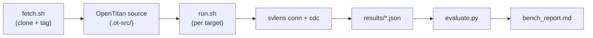

# OpenTitan Benchmark Design Spec

> **Status:** Approved
> **Date:** 2026-04-03
> **Scope:** Benchmark svlens against OpenTitan to measure real-world accuracy and performance

---

## 1. Goal

Run svlens (conn + cdc modes) on OpenTitan RTL to objectively measure:
- Whether svlens handles real SoC-scale designs without crash/OOM/timeout
- CDC recall and precision against OpenTitan's known CDC waivers and clock structure
- Connectivity analysis coverage limitations (baseline for procedural tracking work)
- Performance characteristics (time, memory) at scale

This is a **self-quality measurement** — no commercial tool comparison required. OpenTitan's
own CDC waivers, clock definitions, and design documentation serve as ground truth.

Commercial tool comparison (SpyGlass) will be done separately in an appropriate environment.

---

## 2. Directory Structure

```
bench/
  opentitan/
    README.md              # Setup guide and usage instructions
    fetch.sh               # Clone OpenTitan at pinned tag
    run.sh                 # Execute benchmarks (L1-L4 progression)
    targets.yaml           # Benchmark target definitions
    evaluate.py            # Parse results, compute recall/precision
    golden/                # Expected data derived from OpenTitan docs
      aes.yaml             # Known crossings/domains for aes IP
      hmac.yaml            # Known crossings/domains for hmac IP
      uart.yaml            # Known crossings/domains for uart IP
      top_earlgrey.yaml    # Known crossings/domains for full SoC
    results/               # .gitignore — runtime output
```

---

## 3. Workflow



### 3.1 fetch.sh

- Clones OpenTitan into `bench/opentitan/.ot-src/` (gitignored)
- Checks out a pinned tag (e.g., `earlgrey_es_1.0` or latest stable)
- Skips clone if already present at correct tag
- Exits with error if clone fails

### 3.2 targets.yaml

Defines each benchmark target:

```yaml
targets:
  - name: aes
    level: L1
    top_module: aes
    filelist: hw/ip/aes/rtl/aes.filelist.f
    # Alternative: explicit file glob if no .f file
    files_glob: "hw/ip/aes/rtl/*.sv"
    timeout_sec: 120
    golden: golden/aes.yaml

  - name: hmac
    level: L2
    top_module: hmac
    filelist: hw/ip/hmac/rtl/hmac.filelist.f
    timeout_sec: 120
    golden: golden/hmac.yaml

  - name: uart
    level: L3
    top_module: uart
    filelist: hw/ip/uart/rtl/uart.filelist.f
    timeout_sec: 120
    golden: golden/uart.yaml

  - name: top_earlgrey
    level: L4
    top_module: top_earlgrey
    filelist: hw/top_earlgrey/rtl/autogen/top_earlgrey.filelist.f
    timeout_sec: 600
    golden: golden/top_earlgrey.yaml
```

### 3.3 run.sh

For each target in `targets.yaml`:
1. Resolve filelist path relative to `.ot-src/`
2. Run `svlens conn` with `--format json -o results/<name>/conn/`
3. Run `svlens cdc` with `--format json -o results/<name>/cdc/`
4. Record: exit code, wall time (`time`), peak RSS (`/usr/bin/time -v`), timeout status
5. Write per-target summary to `results/<name>/metrics.json`

Progression: L1 → L2 → L3 → L4. If any target crashes, log it and continue to next.

### 3.4 evaluate.py

Reads `results/<name>/cdc/cdc_report.json` and compares against `golden/<name>.yaml`:

- **CDC recall** = (matched known-crossings) / (total known-crossings)
- **CDC precision** = (matched known-crossings) / (total svlens CDC reports excl. Info/Waived)
- **Conn coverage** = total connections found, ports found, issues by category

Outputs `results/bench_report.md` — a markdown table summarizing all targets.

### 3.5 make bench

```makefile
bench: build
	cd bench/opentitan && bash fetch.sh && bash run.sh && python3 evaluate.py
```

---

## 4. Benchmark Targets (Progressive Scaling)

| Level | Target | Est. Size | Clock Domains | Verification Focus |
|-------|--------|-----------|---------------|-------------------|
| **L1** | `hw/ip/aes` | ~5K LoC | 2 (main + idle) | Multi-domain IP, known CDC |
| **L2** | `hw/ip/hmac` | ~3K LoC | 1-2 | Simple structure baseline |
| **L3** | `hw/ip/uart` | ~2K LoC | 2 (bus + baud) | External interface patterns |
| **L4** | `hw/top_earlgrey` | ~300K LoC | 5+ | Full SoC scale test |

L1-L3 validate basic parsing and analysis. L4 tests scale and cross-IP connectivity.

---

## 5. Golden Data Sources

OpenTitan repository contains:

| Source | Path | Provides |
|--------|------|----------|
| CDC waiver TCL | `hw/top_earlgrey/cdc/cdc_waivers.tcl` | Known false positives (waived crossings) |
| Clock structure | `hw/top_earlgrey/data/top_earlgrey.hjson` | Clock domains, relationships |
| IP clock specs | `hw/ip/*/data/*.hjson` | Per-IP clock domain definitions |
| CDC report (if exists) | Various | Known real violations |

`golden/*.yaml` files will be manually curated from these sources. Format:

```yaml
clock_domains:
  - name: clk_main_i
    type: primary
  - name: clk_io_i
    type: primary
    async_to: [clk_main_i]

known_crossings:
  - from_domain: clk_main_i
    to_domain: clk_io_i
    signal_pattern: "*.u_reg.*"
    expected_sync: TwoFF

known_clean:
  - from_domain: clk_main_i
    to_domain: clk_main_i
    description: "same domain, no crossing expected"
```

---

## 6. Metrics

| Metric | Definition | Target |
|--------|-----------|--------|
| **Parse success** | slang elaboration completes without error | L1-L3: must pass. L4: best effort |
| **Runtime** | Wall clock seconds | L1-L3: <30s. L4: <600s |
| **Peak RSS** | Maximum resident set size (MB) | L4: <4GB |
| **CDC recall** | known-crossings detected / total known-crossings | Measure, no target yet |
| **CDC precision** | true-positives / total CDC violations reported | Measure, no target yet |
| **Conn port count** | Total ports extracted | Sanity check vs design size |
| **Conn issue breakdown** | Count per issue type | Baseline for procedural tracking |

No pass/fail thresholds for recall/precision — this is a baseline measurement.
Thresholds will be set after the first run establishes what's realistic.

---

## 7. What This Unlocks

After the benchmark:
- **Objective data** on where svlens breaks or falls short at scale
- **Baseline numbers** for measuring improvement from Tier 1-1 (procedural tracking)
- **Reproducible script** — anyone can run `make bench` and get the same measurement
- **Credibility artifact** — real SoC results for README/documentation

---

## 8. Out of Scope

- Commercial tool comparison (separate effort)
- Fixing any issues found during benchmarking (separate tasks)
- Performance optimization (measure first, optimize later)
- OpenTitan-specific workarounds (if svlens can't parse something, log it as a finding)

---

## 9. Dependencies

- svlens v0.2.3+ (current)
- Python 3.8+ (for evaluate.py — standard library only, no pip deps)
- Git (for fetch.sh)
- `/usr/bin/time` (for RSS measurement)
- Network access (one-time OpenTitan clone)
